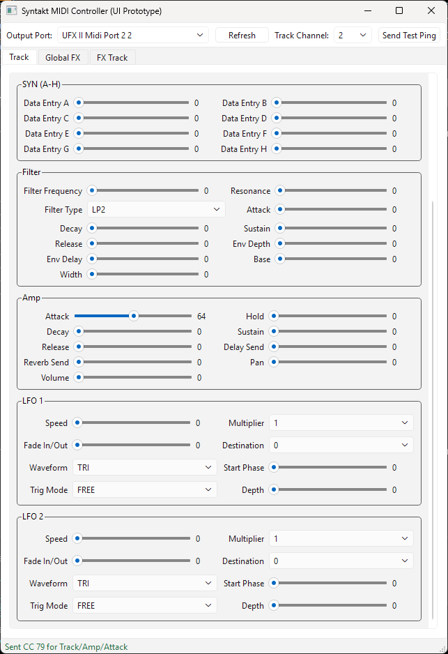

# Syntakt MIDI Controller

[](https://github.com/p3tri3/syntakt_midi_controller/actions/workflows/ci.yml)
[](https://codecov.io/gh/p3tri3/syntakt_midi_controller)
[](https://github.com/p3tri3/syntakt_midi_controller/actions/workflows/codeql.yml)
[](https://github.com/p3tri3/syntakt_midi_controller/actions/workflows/pre-commit.yml)

Desktop Qt6 app for controlling Elektron Syntakt via MIDI CC.

# Known limitations

- MIDI device connectivity has only been tested on Windows.
- The app currently supports one-way control only (sending parameter changes via MIDI CC). It does not read or sync the device state back to the UI, so changes made on the device are not reflected in the app. (A future device-to-UI sync path may be partially possible by handling echoed encoder movement.)

## Screenshot



## Current Status
- UI architecture is split into `ui`, `controllers`, and `services`.
- Parameter key mapping is loaded from `specs/syntakt_midi_parameters.csv`.
- Controller supports:
  - standard 7-bit CC sends
  - high-resolution 14-bit CC send path where `cc_lsb` exists
  - app state tracking (selected channel, output port, parameter values)
  - status/error propagation to the UI status bar
- MIDI is enabled by default using `MidoMidiService`; `NullMidiService` is used when `--no-midi` is passed or when `mido` is not installed.

## Project Layout
- `syntakt_midi_controller.py`: launcher entry script.
- `syntakt_controller/app.py`: Qt app bootstrap.
- `syntakt_controller/controller_models.py`: layout models and app state dataclasses.
- `syntakt_controller/ui/main_window.py`: main UI window and widgets.
- `syntakt_controller/controllers/main_controller.py`: event handling and MIDI action routing.
- `syntakt_controller/services/midi.py`: MIDI service abstraction (`NullMidiService`, `MidoMidiService`).
- `syntakt_controller/services/parameter_mapping.py`: CSV-driven parameter mapping index.
- `tests/`: unit/smoke tests.

## Setup
```bash
python -m venv .venv
source .venv/bin/activate
pip install -e ".[dev]"
```

Optional runtime MIDI dependencies:
```bash
pip install -e ".[dev,midi]"
```

Alternative (redirect via requirements file):
```bash
pip install -r requirements.txt
```

## Run
```bash
python syntakt_midi_controller.py
```

Or via installed script:
```bash
syntakt-midi-controller
```

Optional flags:
```bash
python syntakt_midi_controller.py --no-midi           # disable MIDI (NullMidiService, no hardware required)
python syntakt_midi_controller.py --verbose           # enable debug logging
python syntakt_midi_controller.py --no-midi --verbose
```

MIDI (`MidoMidiService`) is on by default.  If `mido` is not installed the app
falls back to `NullMidiService` automatically with a warning in the log.

Set `SYNTAKT_NO_MIDI=1` in the environment to disable MIDI without a flag (e.g.
in CI or development environments without a connected device).

## Tests
Run tests in headless mode:
```bash
QT_QPA_PLATFORM=offscreen pytest
```

Or use the Makefile shortcuts:
```bash
make test
make lint
make typecheck
make run
```
